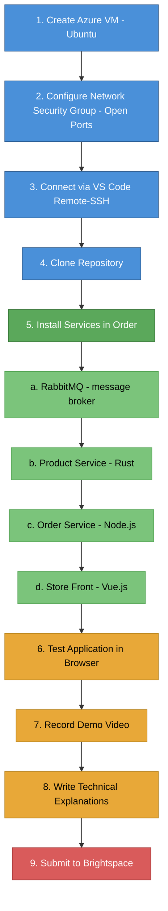
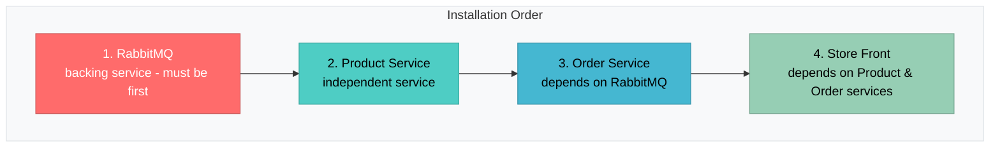

# Lab 1: Running Algonquin Pet Store on an Azure VM

Welcome to the **Algonquin Pet Store** application! This app will help you learn about how modern web applications work by combining several technologies into a working system. The application is built using microservices architecture, which means that different parts of the app work independently but communicate with each other. So, instead of one giant application, we break things down into smaller, independent services that work together.

Think of it like a team:
- One service manages the store's website
- Another handles orders
- Another keeps track of products
- And a special tool makes sure they can all talk to each other smoothly

In this lab, you will learn how to run the Algonquin Pet Store on an Azure Virtual Machine and locally (Optional). This hands-on exercise will teach you how to run a multi-service application and work with cloud VM.


## Table of Contents
- [Lab Objectives](#lab-objectives)
- [Prerequisites](#prerequisites)
- [Architecture Overview](#architecture-overview)
- [Instructions](#instructions)
  - [Step 1: Setting Up an Azure Virtual Machine](#step-1-setting-up-an-azure-virtual-machine)
  - [Step 2: Configure the Network Security Group (NSG)](#step-2-configure-the-network-security-group-nsg)
  - [Step 3: Setting Up VS Code for Remote Development](#step-3-setting-up-vs-code-for-remote-development-on-azure-vm)
  - [Step 4: Install Dependencies on the VM](#step-4-install-dependencies-on-the-vm)
  - [Step 5: Running the Full Application](#step-5-running-the-full-application)
  - [Step 6: Running Locally (Optional)](#step-6-running-the-app-on-your-local-machine-optional)
- [Testing and Verification](#testing-and-verification)

- [Submission](#submission)

## Lab Objectives
- Set up and run the application on an Azure VM
- Understand microservices architecture and inter-service communication
- Configure network security and remote development environment
- Set up and run the application on your local machine (Optional)

## Important Note
**Before you start the lab, please read through the entire instructions carefully.** It is important to understand the flow and requirements fully before beginning the tasks. If you are working in a group, make sure all team members are familiar with the instructions and assigned responsibilities.

> **Tip**: Print or bookmark this page. You'll be referring back to it frequently during the setup process.

## Group Work Recommendation
- You are encouraged to work in pairs (groups of 2)
- However, **each student must prepare and submit their own work**

## Prerequisites

Before starting this lab, ensure you have:

- **Azure Account**: Active Microsoft Azure account with credits (students can use [Azure for Students](https://azure.microsoft.com/en-us/free/students/))
- **VS Code**: Install [Visual Studio Code](https://code.visualstudio.com/) (latest version)
- **Git**: Install [Git](https://git-scm.com/downloads) for cloning repositories
- **Web Browser**: Chrome, Firefox, or Edge for testing


## Architecture Overview
Here’s the big picture:


The app uses a microservices architecture. This means that different parts of the app (called "services") do specific jobs and talk to each other to get things done. Here's how they fit together:

- **Store Front (Vue.js)**: A front-end application where customers can browse and order products.
- **Order Service (Node.js)**: Manages customer orders and interacts with RabbitMQ for message queuing.
- **Product Service (Rust)**: Handles product listings. Manages product details and inventory.
- **RabbitMQ**: Message broker for communication between services. Used to queue orders for processing.

## Quick Start Workflow

Here's the high-level process you'll follow:



---


## Instructions
### Step 1: Setting Up an Azure Virtual Machine

1. Navigate to the [Azure Portal](https://portal.azure.com/)
2. Click **Create a Resource** → **Virtual Machine**
3. Configure the VM with the following settings:

#### Basic Configuration
| Setting            | Value                            | Notes                               |
| ------------------ | -------------------------------- | ----------------------------------- |
| **Subscription**   | Your Azure subscription          | Use Azure for Students if available |
| **Resource Group** | Create new: `lab1-petstore-rg`   | Helps organize resources            |
| **VM Name**        | `petstore-vm`                    | Choose a descriptive name           |
| **Region**         | Choose nearest region            | e.g., Canada Central, East US       |
| **Image**          | Ubuntu 24.04 LTS or 22.04 LTS    | Use Long Term Support version       |
| **Size**           | Standard B2s (2 vCPUs, 4GB RAM)  | Adequate for all services           |
| **Authentication** | SSH public key                   | More secure than password           |
| **Username**       | `azureuser` (or your preference) | Remember this for SSH               |

#### SSH Key Setup
- **Option 1 (Recommended)**: Select "Generate new key pair"
  - When you click **Review + Create**, Azure will prompt you to download the private key file (e.g., `petstore-vm_key.pem`)
  - **CRITICAL**: Save this file immediately - you cannot download it again!

- **Option 2**: Use existing SSH key if you already have one

#### Save Your Private Key
- **Mac/Linux**: Store in `~/.ssh/` directory
  ```bash
  mkdir -p ~/.ssh
  mv ~/Downloads/petstore-vm_key.pem ~/.ssh/
  chmod 400 ~/.ssh/petstore-vm_key.pem
  ```
- **Windows**: Store in `C:\Users\<YourName>\.ssh\` directory
  ```powershell
  mkdir $HOME\.ssh
  move $HOME\Downloads\petstore-vm_key.pem $HOME\.ssh\
  ```

> **Warning**: If you lose the private key file, you will not be able to access your VM and will need to recreate it!

4. Leave other settings as default (Disks, Networking will be configured next)
5. Click **Review + Create** → **Create**
6. Wait for deployment to complete (~3-5 minutes)
7. **Important**: Once created, navigate to your VM and note down the **Public IP Address** (you'll need this throughout the lab)

**Expected Result**: VM is running and you have its public IP address saved.

### Step 2: Configure the Network Security Group (NSG)

#### Understanding Network Security Groups
When you create a Virtual Machine in Azure, by default it is **locked down for security**. This means people (including you) cannot access the services running on the VM unless you explicitly allow them.

Think of an NSG like a **firewall**: it controls which traffic is allowed **in** (Inbound Rules) and which traffic is allowed **out** (Outbound Rules). Since our application runs multiple services on different ports, we must tell Azure to open those ports so we can access them from our browser.

#### Opening Required Ports

1. In the Azure portal, navigate to your VM
2. Click on **Networking** in the left sidebar
3. Click on **Network settings**
4. Click **Create port rule** → **Inbound port rule** for each port below

**Required Ports to Open:**

| Port      | Service         | Protocol | Priority | Source | Required? | Purpose                                             |
| --------- | --------------- | -------- | -------- | ------ | --------- | --------------------------------------------------- |
| **8080**  | Store Front     | TCP      | 320      | Any    | Yes       | Vue.js web interface - main customer-facing website |
| **3000**  | Order Service   | TCP      | 330      | Any    | Yes       | Node.js API - processes customer orders             |
| **3030**  | Product Service | TCP      | 340      | Any    | Yes       | Rust API - manages product catalog and inventory    |
| **15672** | RabbitMQ Admin  | TCP      | 350      | Any    | Optional  | Management UI for monitoring message queues         |

#### How to Add Each Port Rule

For each port, create a rule with these settings:
- **Source**: Any
- **Source port ranges**: *
- **Destination**: Any
- **Service**: Custom
- **Destination port ranges**: [the port number, e.g., 8080]
- **Protocol**: TCP
- **Action**: Allow
- **Priority**: [use the priority from table above]
- **Name**: `Allow-Port-[port-number]` (e.g., `Allow-Port-8080`)
- **Description**: [Service name from table]

> **Note**: Port 22 (SSH) should already be open by default. Don't delete it or you'll lose access to your VM!

> **Optional**: Port 15672 is for the RabbitMQ management dashboard. It's helpful for debugging and learning, but not required for the application to function.

**Expected Result**: All four port rules are visible in the Networking section's inbound port rules list.  

### Step 3: Setting Up VS Code for Remote Development on Azure VM

Instead of using a regular SSH terminal, you can use VS Code to remotely access the VM, making it easier to work on files and manage services. This gives you a full IDE experience directly on your Azure VM!

#### Install the Remote-SSH Extension

1. Open VS Code on your local machine
2. Open the Extensions view (`Ctrl + Shift + X` or `Cmd + Shift + X` on Mac)
3. Search for **"Remote - SSH"** by Microsoft
4. Click **Install**

#### Add Your Azure VM as an SSH Host

1. Open the Command Palette (`Ctrl + Shift + P` or `Cmd + Shift + P` on Mac)
2. Type and select: **Remote-SSH: Add New SSH Host**
3. Enter the SSH command in this format:
   ```bash
   ssh -i /path/to/your-key.pem azureuser@<Your-VM-Public-IP>
   ```

**Examples:**
- **Mac/Linux**:
  ```bash
  ssh -i ~/.ssh/petstore-vm_key.pem azureuser@20.50.100.200
  ```
- **Windows**:
  ```bash
  ssh -i "C:\Users\YourName\.ssh\petstore-vm_key.pem" azureuser@20.50.100.200
  ```

4. When prompted, select the SSH configuration file to update:
   - **Mac/Linux**: `/Users/YourName/.ssh/config`
   - **Windows**: `C:\Users\YourName\.ssh\config`
5. VS Code will confirm the host has been added

#### Connect to Your Azure VM

1. Open the Command Palette again (`Ctrl/Cmd + Shift + P`)
2. Type and select: **Remote-SSH: Connect to Host…**
3. Select your Azure VM from the list (e.g., `20.50.100.200`)
4. A new VS Code window will open
5. Select **Linux** as the platform (first time only)
6. VS Code will install its server components on the VM (this takes ~1 minute the first time)
7. Once connected, you'll see **SSH: [your-vm-ip]** in the bottom-left corner of VS Code


**Expected Result**: VS Code is connected to your Azure VM, and you can see the remote file system in the Explorer panel.


### Step 4: Install Dependencies on the VM

Now that you're connected to your Azure VM via VS Code, it's time to clone the repository and set up all the services.

#### 4.1: Open Terminal and Clone Repository

1. In VS Code (connected to your VM), open a new terminal:
   - Menu: **Terminal** → **New Terminal**
   - Or press: `Ctrl + Shift + ` ` (backtick)
   - Or Command Palette: `Terminal: Create New Terminal`

2. Clone the course repository:
   ```bash
   git clone <repository-url>
   cd 26W_CST8915_Lab1
   ```
   > Replace `<repository-url>` with the actual repository URL provided by your instructor

3. Verify the project structure:
   ```bash
   ls -la
   ```
   You should see: `RabbitMQ/`, `order-service/`, `product-service/`, `store-front/`, and `README.md`

#### 4.2: Service Installation Order

**IMPORTANT**: Services must be installed and started in this specific order because they depend on each other:



#### 4.3: Install RabbitMQ (Message Broker)

**What is RabbitMQ?**
- A **message broker** (like a post office for your services)
- Services send messages to queues, and RabbitMQ delivers them reliably in order
- Ensures messages (like "Customer placed order #123") don't get lost
- Critical dependency: Must be running before Order Service starts

**Installation:**
1. Navigate to the RabbitMQ directory:
   ```bash
   cd ~/26W_CST8915_Lab1/RabbitMQ
   ```

2. Follow the detailed instructions in [RabbitMQ/README.md](RabbitMQ/README.md)

3. **Test the management UI** (optional but recommended):
   - Open browser: `http://<Your-VM-IP>:15672`
   - Login: username `guest`, password `guest`
   - You should see the RabbitMQ dashboard

> **Common Issue**: If you see "Failed to connect", make sure port 15672 is open in your NSG (Step 2)

**Expected Result**: RabbitMQ service is active and management UI is accessible.

---

#### 4.4: Install Product Service (Rust)

**What is Product Service?**
- Manages the **product catalog**: names, descriptions, prices, and stock levels
- Written in **Rust**: a fast, memory-safe language ideal for high-performance APIs
- Provides REST API endpoints for listing products
- Runs on port **3030**

**Installation:**
1. Navigate to the product-service directory:
   ```bash
   cd ~/26W_CST8915_Lab1/product-service
   ```

2. Follow the detailed instructions in [product-service/README.md](product-service/README.md)

3. **Start the service** (after installation):
   ```bash
   cargo run
   ```
   You should see: `Listening on 0.0.0.0:3030`


> **Note**: Keep this terminal window open with the service running. To stop it later, press `Ctrl + C`

**Expected Result**: Product service is running on port 3030 and returns product data via API.

---

#### 4.5: Install Order Service (Node.js)

**What is Order Service?**
- Handles **customer orders**: receiving, processing, and queuing orders
- Written in **Node.js**: JavaScript runtime for building scalable backend services
- Communicates with **RabbitMQ** to queue order messages
- Provides REST API for order submission
- Runs on port **3000**

**Installation:**
1. Open a new terminal tab (`Ctrl + Shift + 5`)
2. Navigate to the order-service directory:
   ```bash
   cd ~/26W_CST8915_Lab1/order-service
   ```

3. Follow the detailed instructions in [order-service/README.md](order-service/README.md)

4. **Start the service** (after installation):
   ```bash
   node index.js
   ```
   You should see: `Order service listening on port 3000`

> **Note**: Keep this terminal window open with the service running

**Expected Result**: Order service is running on port 3000 and can receive order requests.

---

#### 4.6: Install Store Front (Vue.js)

**What is Store Front?**
- The **customer-facing website**: the UI that shoppers interact with
- Built with **Vue.js**: a modern JavaScript framework for building interactive web apps
- Displays products from Product Service
- Sends orders to Order Service
- Runs on port **8080**

**Installation:**
1. Open a new terminal tab (`Ctrl + Shift + 5`)
2. Navigate to the store-front directory:
   ```bash
   cd ~/26W_CST8915_Lab1/store-front
   ```

3. Follow the detailed instructions in [store-front/README.md](store-front/README.md)

4. **Start the service** (after installation):
   ```bash
   npm run serve
   ```
   You should see:
   ```
   App running at:
   - Local:   http://localhost:8080/
   - Network: http://<VM-IP>:8080/
   ```

5. **Verify it's working**:
   - Open browser: `http://<Your-VM-IP>:8080`
   - You should see the Algonquin Pet Store homepage with product listings

> **Note**: Keep this terminal window open with the service running

**Expected Result**: Store front is accessible in your browser, showing products from the Product Service.

---

#### 4.7: Summary - All Services Running

At this point, you should have **4 terminal windows** open in VS Code, each running a service:

| Terminal | Service         | Command                     | Port        | Status Check                               |
| -------- | --------------- | --------------------------- | ----------- | ------------------------------------------ |
| 1        | RabbitMQ        | System service (background) | 5672, 15672 | `sudo systemctl status rabbitmq-server`    |
| 2        | Product Service | `cargo run`                 | 3030        | `curl http://localhost:3030/api/products`  |
| 3        | Order Service   | `node index.js`             | 3000        | Service log shows "listening on port 3000" |
| 4        | Store Front     | `npm run serve`             | 8080        | Open `http://<VM-IP>:8080` in browser      |

> **Tip**: To stop any service, go to its terminal and press `Ctrl + C`

> **Tip**: If you close a terminal accidentally, just navigate back to that service's directory and run the start command again

### Step 5: Running the Full Application

Congratulations! If you've followed all the steps, your microservices application should now be fully operational.

#### Access Your Application

1. Open your web browser
2. Navigate to: `http://<Your-VM-Public-IP>:8080`
   - Example: `http://20.51.123.45:8080`

#### What You Should See

- **Homepage**: The Algonquin Pet Store interface
- **Product Listings**: Products loaded from the Product Service (port 3030)
- **Shopping Functionality**: Ability to add items to cart
- **Order Placement**: When you place an order, it goes through the Order Service (port 3000) and into RabbitMQ

#### Test the Complete Workflow

1. **Browse Products**: You should see a list of pet products with images, descriptions, and prices
2. **Add to Cart**: Click on a product and add it to your cart
3. **Place Order**: Complete the checkout process
4. **Verify Order Processing**:
   - Check the Order Service terminal - you should see log messages about the order
   - Check RabbitMQ Management UI (`http://<VM-IP>:15672`) - you should see messages in the queue

> **Success Criteria**: You can successfully browse products, add them to cart, and place orders without errors.

---

### Step 6: Running the App on Your Local Machine (Optional)

This step is **completely optional** and will not affect your grade. Running locally can be useful for faster development and testing without consuming Azure credits.

#### Prerequisites for Local Setup

Before running locally, ensure you have installed:
- **Node.js** v18+ ([Download](https://nodejs.org/))
- **Rust** with Cargo ([Installation Guide](https://www.rust-lang.org/tools/install))
- **RabbitMQ** ([Installation Guide](https://www.rabbitmq.com/download.html))
- **Git** ([Download](https://git-scm.com/downloads))

**For Windows users**: Use WSL2 with Ubuntu 22.04+ for the best experience.

#### Installation Steps

1. **Clone the repository on your local machine**:
   ```bash
   git clone <repository-url>
   cd 26W_CST8915_Lab1
   ```

2. **Follow the same installation process as Step 4**, but on your local machine:
   - Install RabbitMQ first
   - Install Product Service
   - Install Order Service
   - Install Store Front

3. **Key Difference**: Configuration uses `localhost` instead of VM IP
   - Services communicate via `localhost` or `127.0.0.1`
   - No need to configure Network Security Groups
   - All ports are accessible by default on your local machine

#### Access Your Local Application

1. Open your browser and navigate to: [http://localhost:8080](http://localhost:8080)
2. The Store Front will load and display products from your local Product Service
3. When you place an order:
   - The Order Service processes it on port 3000
   - RabbitMQ queues the message for processing
   - All communication happens entirely on your local machine

#### Benefits of Local Development
- Faster iteration and testing
- No internet connection required (after initial setup)
- No Azure costs
- Easier debugging with local tools
---

## Testing and Verification

Use this checklist to verify your application is working correctly:

- [ ] **RabbitMQ is running**
- [ ] **Product Service is running**
- [ ] **Order Service is running**
- [ ] **Store Front is accessible**
  - Browser loads `http://<VM-IP>:8080` successfully
  - Product listings are visible on the homepage

- [ ] **End-to-End Functionality Works**
  - Can browse products without errors
  - Can add products to cart
  - Can place an order successfully
  - Order appears in RabbitMQ queue (check management UI)

- [ ] **Network Security Group Configured**
  - Ports 8080, 3000, 3030, and 15672 are open
  - Services are accessible from your local browser (not just from the VM)

### How to Know You're Done

Your application is ready when:
1. All services start without errors
2. The store front loads in your browser at `http://<VM-IP>:8080`
3. Products display correctly on the homepage
4. You can successfully place an order
5. The order appears in RabbitMQ (visible in management UI)
6. All checklist items above are completed

---

## Submission

For this first lab, you will demonstrate both your ability to get the system running and your understanding of the individual services.

### What to Submit

Your submission consists of three components, all contained in a new dedicated GitHub repository for this lab:

#### 1. Demo Video (Max 5 minutes)

Record a short screencast demonstrating your running application.

**Required Content**:
- [ ] Show the application running on your **Azure VM** (not local)
- [ ] Display the Store Front in browser at `http://<VM-IP>:8080`
- [ ] Show the product listings loaded from the Product Service
- [ ] Demonstrate placing an order through the Order Service
- [ ] (Optional but recommended) Show RabbitMQ management UI with queued messages
- [ ] (Optional) Briefly show your VS Code setup connected to the Azure VM

**Recording Tools** (choose one):
- **OBS Studio** (free, powerful): [https://obsproject.com/](https://obsproject.com/)
- **Loom** (free, easy): [https://www.loom.com/](https://www.loom.com/)
- **Windows Game Bar** (Windows built-in): Press `Win + G`
- **QuickTime** (Mac built-in): File → New Screen Recording
- **ShareX** (Windows, free): [https://getsharex.com/](https://getsharex.com/)


**Upload Instructions**:
1. Upload your video to **YouTube**
   - Set visibility to **Unlisted** (not Private - instructors won't be able to view Private videos)
   - Title: "CST8915 Lab 1 - [Your Name]"
2. Copy the video URL (e.g., `https://www.youtube.com/watch?v=...`)
3. Include this link in your GitHub repository README

---

#### 2. Technical Explanations

Examine the source code of each service and write technical explanations demonstrating your understanding.

**For Each Service (Order Service, Product Service, Store Front)**:

Write 1-2 paragraphs covering:
- **Purpose**: What is this service responsible for?
- **Technology Stack**: Which language/framework does it use and why?
- **Architecture Role**: How does it fit into the microservices architecture?
- **Inter-Service Communication**: How does it interact with other services?

---

#### 3. GitHub Repository

Create a **public** GitHub repository containing your submission materials.

**Required Repository Structure**:

```
your-repo-name/
├── README.md                  # Main submission document
├── screenshots/               # Optional: screenshots of your deployment
│   ├── store-front.png
│   ├── rabbitmq-dashboard.png
│   └── order-confirmation.png
└── notes.md                   # Optional: setup challenges, learnings
```

**README.md Template**:

```markdown
# CST8915 Lab 1: Algonquin Pet Store on Azure VM

**Student Name**: [Your Name]
**Student ID**: [Your Student ID]
**Course**: CST8915 Full-stack Cloud-native Development
**Semester**: Winter 2026

---

## Demo Video

🎥 [Watch Demo Video](https://www.youtube.com/watch?v=YOUR_VIDEO_ID)

---

## Technical Explanations

### Order Service (Node.js)

[Your explanation here - 1-2 paragraphs]

### Product Service (Rust)

[Your explanation here - 1-2 paragraphs]

### Store Front (Vue.js)

[Your explanation here - 1-2 paragraphs]


---

## Challenges and Learnings (Optional)

[Share any interesting challenges you faced during setup, how you solved them,
and what you learned from this lab experience]

---

## Acknowledgments

[Optional: Credit any resources, documentation, or people who helped you]
```


---

### How to Submit

1. **Verify Your Submission**:
   - [ ] GitHub repository is **public** and accessible
   - [ ] README.md contains the YouTube video link
   - [ ] YouTube video is **Unlisted** (not Private)
   - [ ] Technical explanations for all three services are complete
   - [ ] Video demonstrates all required functionality
   - [ ] Repository URL works when opened in incognito/private browser window

2. **Submit to Brightspace**:
   - Go to the Lab 1 assignment in Brightspace
   - Submit the **GitHub repository URL** (e.g., `https://github.com/your-username/cst8915-lab1-petstore`)
   - Add any additional comments if needed

3. **Submission Deadline**:
   - Check Brightspace for the exact due date and time

---

